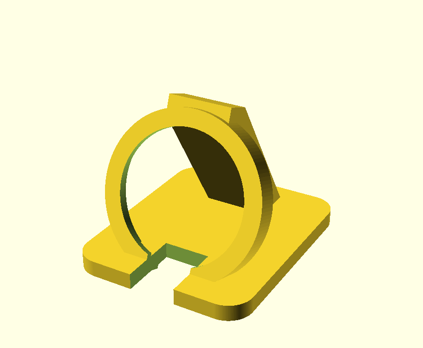

# roundtftmonitor

A desk **PC + Claude usage monitor** on a 1.28″ round ESP32 display
(GUITION **ESP32-2424S012**, ESP32-C3 + GC9A01 + CST816 touch).

Two touch-paged screens:

- **PC** — outer ring = **CPU %**, inner ring = **RAM %**, with the live numbers
  in the middle. Thin outer rings hint the Claude session/week.
- **Claude** — outer ring = **5-hour session %**, inner = **7-day week %**, each
  with a **period-progress bar** and **time-left** label (e.g. `2h left`, `7d left`).
  Thin outer rings hint CPU/RAM.

Colors are green < 60 %, amber 60–85 %, red > 85 %. A small white tick marks each
gauge's 0/start. **Short tap** switches pages; **long-press (>0.6 s)** rotates 90°.

> Heads-up: the Claude session/week figures come from an **undocumented**
> endpoint (see [Claude usage](#claude-usage)); it can change or break without notice.

## How it works

```
 Windows host (host/pc_monitor.py)            ESP32-2424S012 (firmware/monitor)
 ─ reads CPU%/RAM% (psutil)                    ─ parses "key=value" serial lines
 ─ reads Claude session/week % + hours-left    ─ draws two ring-gauge pages
   from the OAuth usage endpoint        ──USB──▶  (touch: tap=page, long=rotate)
 ─ streams one line/sec over COM5 @115200
```

Example line: `cpu=37.5 ram=61.2 sess=26 week=56 sessp=44 weekp=99 sessh=2.8 weekh=8`

## Hardware

| Function | GPIO | | Function | GPIO |
|---|---|---|---|---|
| LCD SCLK | 6 | | Touch SDA (I²C) | 4 |
| LCD MOSI | 7 | | Touch SCL (I²C) | 5 |
| LCD DC | 2 | | Touch INT | 0 |
| LCD CS | 10 | | Touch RST | 1 |
| LCD backlight | 3 | | BOOT button | 9 |
| LCD RST | tied to chip reset | | GPIO 8 | free |

ESP32-C3 (RISC-V @160 MHz, Wi-Fi+BLE5, 4 MB flash, native USB-Serial/JTAG),
GC9A01 240×240 round IPS, CST816D touch (I²C 0x15), no IMU. Full identification:
[`roundtft-hardware.md`](roundtft-hardware.md).

## Build & flash (firmware)

Uses **arduino-cli** + the ESP32 core + **LovyanGFX**.

```sh
FQBN=esp32:esp32:esp32c3:CDCOnBoot=cdc,FlashSize=4M   # CDCOnBoot=cdc is required
arduino-cli compile --fqbn $FQBN --build-path firmware/monitor/build firmware/monitor
arduino-cli upload  -p COM5 --fqbn $FQBN --input-dir firmware/monitor/build firmware/monitor
```

Stop the host agent before flashing (it holds COM5). To restore the as-shipped
GUITION demo: `esptool --port COM5 write-flash 0x0 backup-firmware-stock-4MB.bin`.

## Host agent

```sh
pip install pyserial psutil
python host/pc_monitor.py        # auto-detects the board's COM port
```

CPU%/RAM% come from plain perf counters (no driver, no admin) and update every
second; Claude usage is polled every 5 minutes. To start it automatically at logon,
run `host/install-startup.ps1` once. See [`host/README.md`](host/README.md) for
autostart management and cable/port troubleshooting.

## Claude usage

Session/week % and time-left are read from the **undocumented**
`GET https://api.anthropic.com/api/oauth/usage` using the OAuth token Claude Code
stores in `~/.claude/.credentials.json` (`five_hour` / `seven_day` utilization +
`resets_at`). There is no official API for this; the endpoint may change or break.

## 3D-printed tilt stand

Parametric angled cradle in [`stand/`](stand/) (`stand.scad` → `stand.stl`).
Verify `disc_d` / `disc_t` with calipers first. See [`stand/README.md`](stand/README.md).



## Repo layout

| Path | What |
|---|---|
| `firmware/monitor/` | the monitor sketch (flash this) |
| `firmware/probe/`, `firmware/i2cscan/` | bring-up helpers (pin test, I²C scan) |
| `host/` | Windows serial agent + launcher |
| `stand/` | OpenSCAD tilt stand + renders |
| `PROJECT.md` | design notes, decisions, status |
| `CLAUDE.md` | operational notes & gotchas |
| `roundtft-hardware.md` | chip/board identification |
| `backup-firmware-stock-4MB.bin` | as-shipped firmware (restore point) |

---
🤖 Built with [Claude Code](https://claude.com/claude-code).
